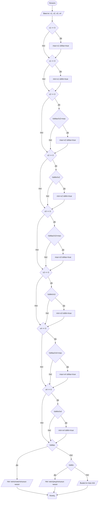

## Cодержание

1. [Отчет по лабораторной работе № N](#отчет-по-лабораторной-работе--n)

## Отчет по лабораторной работе № 1

#### № группы: `ПМ-2402`

#### Выполнил: `Чижевская Софья Петровна`

#### Вариант: `29`

### Cодержание:

- [Постановка задачи](#1-постановка-задачи)
- [Входные и выходные данные](#2-входные-и-выходные-данные)
- [Математическая модель](#25-математическая-модель)
- [Выбор структуры данных](#3-выбор-структуры-данных)
- [Алгоритм](#4-алгоритм)
- [Программа](#5-программа)
- [Анализ правильности решения](#6-анализ-правильности-решения)

### 1. Постановка задачи

- Условие

> На вход программы подается четыре различных целых числа. Вывести на
экран разность максимального неположительного и минимального неотрицательного числа.


- Данная задача требует проверки введённых чисел на наличие неотрицательных и неположительных.
  Если отсутствуют и те и другие, то код прекратит работу. Если есть неотрицательные и неположительные
  целые числа, то мы найдём разность максимального неположительного и минимального неотрицательного.

### 2. Входные и выходные данные

#### Данные на вход

На вход программа получает 4 различных целых (по условию) числа. В условии не сказано про
нижние и верхние границы. Из этого мы можем сделать вывод, что нашей областью значений
являются все целые числа.

|              | Тип                  | min значение | max значение |
|--------------|----------------------|--------------|--------------|
| X1 (Число 1) | Целочисленное число  | -            | -            |
| X2 (Число 2) | Целочисленное число  | -            | -            |
| X3 (Число 3) | Целочисленное число  | -            | -            |
| X4 (Число 4) | Целочисленное число  | -            | -            |

#### Данные на выход

Т.к. программа должна вывести разность максимального неотрицательного и минимального неположительного,
то на выходе мы получим одно целочисленное отрицательное число.

|         | Тип                                 | min значение | max значение |
|---------|-------------------------------------|--------------|--------------|
| Число 1 | Целочисленное неотрицательное число | -            | -1           |

### 3. Выбор структуры данных

Программа получает 4 целочисленных числа. Поэтому для их хранения
можно выделить 4 переменных (`x`, `x2`, `x3`, `x4`) типа `int`.

|              | название переменной | Тип (в Java) | 
|--------------|---------------------|--------------|
| X (Число 1)  | `x1`                | `int`        |
| X2 (Число 2) | `x2`                | `int`        |
| X3 (Число 3) | `x3`                | `int`        |
| X4 (Число 4) | `x4`                | `int`        | 

Для вывода результата необязательно его хранить в отдельной переменной.

### 4. Алгоритм

#### Алгоритм выполнения программы:


### 5. Программа
```java
import java.io.PrintStream;
import java.util.Scanner;
public class Main {
    // Объявляем объект класса Scanner для ввода данных
    public static Scanner in = new Scanner(System.in);
    // Объявляем объект класса PrintStream для вывода данных
    public static PrintStream out = System.out;
    public static void main(String[] args) {
        out.println("Введите четыре числа");
        // Считывание четырех целых чисел x1 x2 x3 x4 из консоли
        int x1 = in.nextInt();
        int x2 = in.nextInt();
        int x3 = in.nextInt();
        int x4 = in.nextInt();
        int min = 0;
        int max = 0;
        boolean isMax=false;
        boolean isMin=false;
        //Проверяем каждое введённое число на положительность и отрицательность

        if (x1<=0)//x1 неположительное
        {//Если x1 неположительное, то заносим его в переменную max
            max=x1;
            isMax=true;
        }
        if (x1>=0)//x1 неотрицательное
        {//Если x1 неотрицательное, то заносим его в переменную min
            min=x1;
            isMin=true;
        }
        if (x2<=0)//x2 неположительное
        {//Если x2 неположительное и х2 больше, чем максимальное неположительное, то заносим его в переменную max
            if (!isMax || x2>max){
                max=x2;
                isMax=true;
            }
        }
        if (x2>=0)//x2 неотрицательное
        {//Если x2 неотрицательное и х2 меньше, чем максимальное неположительное, то заносим его в переменную min
            if (!isMin || x2<min){
                min=x2;
                isMin=true;
            }
        }
        if (x3<=0)//x3 неположительное
        {//Если x3 неположительное и х3 больше, чем максимальное неположительное, то заносим его в переменную max
            if (!isMax || x3>max){
                max=x3;
                isMax=true;
            }
        }
        if (x3>=0)//x3 неотрицательное
        {//Если x3 неотрицательное и х3 меньше, чем максимальное неположительное, то заносим его в переменную min
            if (!isMin || x3<min){
                min=x3;
                isMin=true;
            }
        }
        if (x4<=0)//x4 неположительное
        {//Если x4 неположительное и х4 больше, чем максимальное неположительное, то заносим его в переменную max
            if (!isMax || x4>max){
                max=x4;
                isMax=true;
            }
        }
        if (x4>=0)//x4 неотрицательное
        {//Если x4 неотрицательное и х4 меньше, чем максимальное неположительное, то заносим его в переменную min
            if (!isMin || x4<min){
                min=x4;
                isMin=true;
            }
        }
        if (!isMax){//Если отсутствуют неположительные числа
            out.println("Нет неположительных чисел");
        }
        else  if (!isMin){//Если отсутствуют неотрицательные числа
            out.println("Нет неотрицательных чисел");
        }
        else{//Если есть и те и те числа, то выводим результат
            out.println("Разность максимального неположительного и минимального неотрицательного:");
            out.println(max-min);
        }
    }
}
```
### 6. Анализ правильности решения

Программа работает корректно на всем множестве решений с учетом ограничений.

1. Тест на `x1 <= 0, x2 <= 0, x2 <= 0, x2 <= 0`:

    - **Input**:
        ```
        -5 -4 -3 -1
        ```

    - **Output**:
        ```
        Нет неотрицательных чисел
        ```

2. Тест на `x1 >= 0, x2 >= 0, x2 >= 0, x2 >= 0`:

    - **Input**:
        ```
        5 4 3 1
        ```

    - **Output**:
        ```
        Нет неположительных чисел
        ```

3. Тест на `x1 >= 0, x2 <= 0, x3 >= 0, x4 <= 0 `:

    - **Input**:
        ```
        21 -15 13 -2
        ```

    - **Output**:
        ```
        -15
        ```

4. Тест на `x1 == x2 && x1 == x3 && x4!=x3 `:

   - **Input**:
       ```
       15 15 15 -2
       ```

   - **Output**:
       ```
       -17
       ```

5. Тест на `x1 == 0 && x2 == 0 && x3 == 0 && x4 == 0 `:

    - **Input**:
        ```
        0 0 0 0
        ```

    - **Output**:
        ```
        0
        ```

6. Тест на `x1 <= 0 && x2 <= 0 && x3 <= 0 && x4 >= 0`:

    - **Input**:
        ```
        -7 - 8 - 9 10
        ```

    - **Output**:
        ```
        -17
        ```

7. Тест на `(x1 <= 0 && x2 <= 0 && x <= 0 && x > 0) && (x1 == x2 == x3)`:

    - **Input**:
        ```
      -7 -7 -7 13
      ```
    - **Output**:
     ```
     -20
     ```

8. Тест на `x1 == 0 && x4 == 0`:

    - **Input**:
        ```
      0 -1 1 0
      ```
    - **Output**:
     ```
     0
     ```

